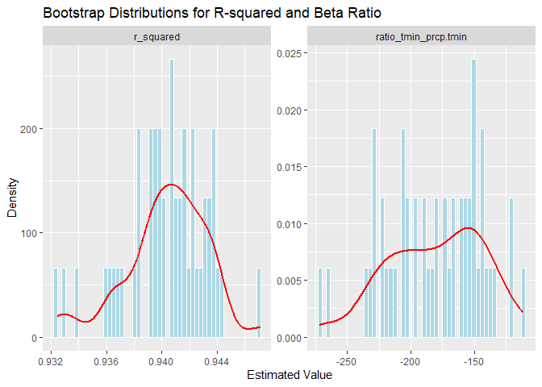

p8105_hw6_th3147
================
Te-Hsuan Huang
2025-12-01

# Problem 2

### Loading the package

``` r
library(tidyverse)
```

    ## Warning: package 'tidyverse' was built under R version 4.5.2

    ## ── Attaching core tidyverse packages ──────────────────────── tidyverse 2.0.0 ──
    ## ✔ dplyr     1.1.4     ✔ readr     2.1.5
    ## ✔ forcats   1.0.0     ✔ stringr   1.5.1
    ## ✔ ggplot2   3.5.2     ✔ tibble    3.3.0
    ## ✔ lubridate 1.9.4     ✔ tidyr     1.3.1
    ## ✔ purrr     1.1.0     
    ## ── Conflicts ────────────────────────────────────────── tidyverse_conflicts() ──
    ## ✖ dplyr::filter() masks stats::filter()
    ## ✖ dplyr::lag()    masks stats::lag()
    ## ℹ Use the conflicted package (<http://conflicted.r-lib.org/>) to force all conflicts to become errors

``` r
library(p8105.datasets)
```

### Loading the data

``` r
data("weather_df")
set.seed(1)
```

### Make a function

``` r
extract_stats_vector <- function(model) {
  
  r_squared <- summary(model)$r.squared
  
  coeffs <- coef(model)
  
  ratio_beta1_beta2 <- coeffs["tmin"] / coeffs["prcp"]
  
  c(r_squared = r_squared, ratio_tmin_prcp = ratio_beta1_beta2)
}
```

### Perform boostrap

``` r
bootstrap_results <- 
  weather_df |> 
  modelr::bootstrap(n = 5000) |> 
  mutate(
    stats = map(strap, 
                ~ lm(tmax ~ tmin + prcp, data = as_tibble(.)) |> 
                    extract_stats_vector()
                )
  ) |> 
  unnest_wider(stats) |>
  select(strap, r_squared, ratio_tmin_prcp.tmin)
```

### Make a plot

``` r
bootstrap_plot <- 
  bootstrap_results |> 
  pivot_longer(
    cols = c(r_squared, ratio_tmin_prcp.tmin),
    names_to = "statistic",
    values_to = "estimate"
  ) |> 
  ggplot(aes(x = estimate)) +
  geom_histogram(aes(y = after_stat(density)), bins = 50, fill = "lightblue") +
  geom_density(color = "red", linewidth = 1) +
  facet_wrap(~ statistic, scales = "free") +
  labs(
    title = "Bootstrap Distributions for R-squared and Beta Ratio",
    x = "Estimated Value",
    y = "Density"
  )

bootstrap_plot
```

<!-- -->

- The R-squared plot appears approximately normally distributed, whereas
  the ratio of beta1 to beta2 plot shows a negatively skewed
  distribution.

### Calculate 95%CI

``` r
summary_stats <- 
  bootstrap_results |> 
  pivot_longer(
    cols = c(r_squared, ratio_tmin_prcp.tmin),
    names_to = "statistic",
    values_to = "estimate"
  ) |> 
  group_by(statistic) |> 
  summarize(
    boot_se = sd(estimate),
    ci_lower = quantile(estimate, 0.025),
    ci_upper = quantile(estimate, 0.975)
  )

summary_stats
```

    ## # A tibble: 2 × 4
    ##   statistic             boot_se ci_lower ci_upper
    ##   <chr>                   <dbl>    <dbl>    <dbl>
    ## 1 r_squared             0.00314    0.934    0.947
    ## 2 ratio_tmin_prcp.tmin 39.7     -280.    -126.

# Problem 3

### Loading the data

``` r
birthweight_df <- read_csv("birthweight.csv")
```

    ## Rows: 4342 Columns: 20
    ## ── Column specification ────────────────────────────────────────────────────────
    ## Delimiter: ","
    ## dbl (20): babysex, bhead, blength, bwt, delwt, fincome, frace, gaweeks, malf...
    ## 
    ## ℹ Use `spec()` to retrieve the full column specification for this data.
    ## ℹ Specify the column types or set `show_col_types = FALSE` to quiet this message.

### Clean the data

``` r
birthweight_df_clean <- 
  birthweight_df |> 
  janitor::clean_names() |> 
  mutate(
    frace = factor(
      frace,
      levels = c(1, 2, 3, 4, 8, 9), 
      labels = c("White", "Black", "Asian", "Puerto Rican", "Other", "Unknown")
    ),
    mrace = factor(
      mrace,
      levels = c(1, 2, 3, 4, 8), 
      labels = c("White", "Black", "Asian", "Puerto Rican", "Other")
    ),
    malform = factor(
      malform, 
      levels = c(0, 1), 
      labels = c("absent", "present")
    )
  ) |> 
  rename(prev_live_births = parity) |> 
  drop_na()
```

### Check if it is any NA

``` r
missing_summary <- 
  birthweight_df_clean |> 
  summarise(across(everything(), ~ sum(is.na(.))))

missing_summary
```

    ## # A tibble: 1 × 20
    ##   babysex bhead blength   bwt delwt fincome frace gaweeks malform menarche
    ##     <int> <int>   <int> <int> <int>   <int> <int>   <int>   <int>    <int>
    ## 1       0     0       0     0     0       0     0       0       0        0
    ## # ℹ 10 more variables: mheight <int>, momage <int>, mrace <int>,
    ## #   prev_live_births <int>, pnumlbw <int>, pnumsga <int>, ppbmi <int>,
    ## #   ppwt <int>, smoken <int>, wtgain <int>
