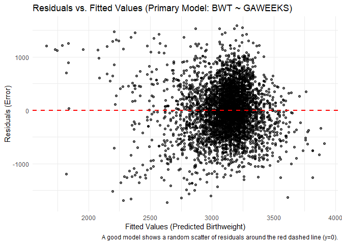
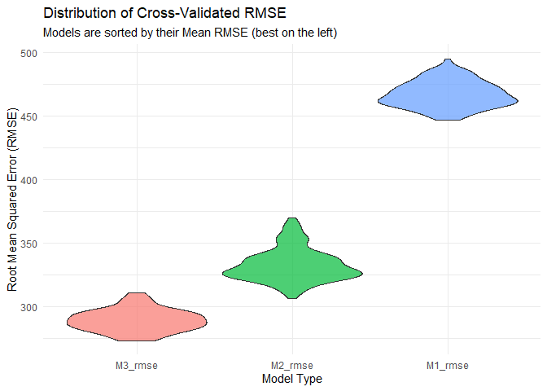

p8105_hw6_th3147
================
Te-Hsuan Huang
2025-12-01

# Problem 2

### Loading the package

``` r
library(tidyverse)
```

    ## Warning: package 'tidyverse' was built under R version 4.5.2

    ## ── Attaching core tidyverse packages ──────────────────────── tidyverse 2.0.0 ──
    ## ✔ dplyr     1.1.4     ✔ readr     2.1.5
    ## ✔ forcats   1.0.0     ✔ stringr   1.5.1
    ## ✔ ggplot2   3.5.2     ✔ tibble    3.3.0
    ## ✔ lubridate 1.9.4     ✔ tidyr     1.3.1
    ## ✔ purrr     1.1.0     
    ## ── Conflicts ────────────────────────────────────────── tidyverse_conflicts() ──
    ## ✖ dplyr::filter() masks stats::filter()
    ## ✖ dplyr::lag()    masks stats::lag()
    ## ℹ Use the conflicted package (<http://conflicted.r-lib.org/>) to force all conflicts to become errors

``` r
library(p8105.datasets)
library(purrr)
library(modelr)
library(mgcv)
```

    ## Loading required package: nlme
    ## 
    ## Attaching package: 'nlme'
    ## 
    ## The following object is masked from 'package:dplyr':
    ## 
    ##     collapse
    ## 
    ## This is mgcv 1.9-3. For overview type 'help("mgcv-package")'.

### Loading the data

``` r
data("weather_df")

weather_df <- 
  weather_df |> 
  filter(name == "CentralPark_NY")

set.seed(1)
```

### Make a function

``` r
extract_stats_vector <- function(model) {
  
  r_squared <- summary(model)$r.squared
  
  coeffs <- coef(model)
  
  ratio_beta1_beta2 <- coeffs["tmin"] / coeffs["prcp"]
  
  c(r_squared = r_squared, ratio_tmin_prcp = ratio_beta1_beta2)
}
```

### Perform boostrap

``` r
bootstrap_results <- 
  weather_df |> 
  modelr::bootstrap(n = 5000) |> 
  mutate(
    stats = map(strap, 
                ~ lm(tmax ~ tmin + prcp, data = as_tibble(.)) |> 
                    extract_stats_vector()
                )
  ) |> 
  unnest_wider(stats) |>
  select(strap, r_squared, ratio_tmin_prcp.tmin)
```

### Make a plot

``` r
bootstrap_plot <- 
  bootstrap_results |> 
  pivot_longer(
    cols = c(r_squared, ratio_tmin_prcp.tmin),
    names_to = "statistic",
    values_to = "estimate"
  ) |> 
  ggplot(aes(x = estimate)) +
  geom_histogram(aes(y = after_stat(density)), bins = 50, fill = "lightblue") +
  geom_density(color = "red", linewidth = 1) +
  facet_wrap(~ statistic, scales = "free") +
  labs(
    title = "Bootstrap Distributions for R-squared and Beta Ratio",
    x = "Estimated Value",
    y = "Density"
  )

bootstrap_plot
```

<!-- -->

- The R-squared plot generally appears normally distributed, but here
  looks negatively skewed distribution. In addition, the ratio of beta1
  to beta2 plot shows a negatively skewed distribution.

### Calculate 95%CI

``` r
summary_stats <- 
  bootstrap_results |> 
  pivot_longer(
    cols = c(r_squared, ratio_tmin_prcp.tmin),
    names_to = "statistic",
    values_to = "estimate"
  ) |> 
  group_by(statistic) |> 
  summarize(
    boot_se = sd(estimate),
    ci_lower = quantile(estimate, 0.025),
    ci_upper = quantile(estimate, 0.975)
  )

summary_stats
```

    ## # A tibble: 2 × 4
    ##   statistic                boot_se  ci_lower ci_upper
    ##   <chr>                      <dbl>     <dbl>    <dbl>
    ## 1 r_squared                0.00866     0.894    0.928
    ## 2 ratio_tmin_prcp.tmin 65127.      -5616.    4587.

# Problem 3

### Loading the data

``` r
birthweight_df <- read_csv("birthweight.csv")
```

    ## Rows: 4342 Columns: 20
    ## ── Column specification ────────────────────────────────────────────────────────
    ## Delimiter: ","
    ## dbl (20): babysex, bhead, blength, bwt, delwt, fincome, frace, gaweeks, malf...
    ## 
    ## ℹ Use `spec()` to retrieve the full column specification for this data.
    ## ℹ Specify the column types or set `show_col_types = FALSE` to quiet this message.

### Clean the data

``` r
birthweight_df_clean <- 
  birthweight_df |> 
  janitor::clean_names() |> 
  mutate(
    frace = factor(
      frace,
      levels = c(1, 2, 3, 4, 8, 9), 
      labels = c("White", "Black", "Asian", "Puerto Rican", "Other", "Unknown")
    ),
    mrace = factor(
      mrace,
      levels = c(1, 2, 3, 4, 8), 
      labels = c("White", "Black", "Asian", "Puerto Rican", "Other")
    ),
    malform = factor(
      malform, 
      levels = c(0, 1), 
      labels = c("absent", "present")
    )
  ) |> 
  rename(prev_live_births = parity) |> 
  drop_na()
```

### Check if it is any NA

``` r
missing_summary <- 
  birthweight_df_clean |> 
  summarise(across(everything(), ~ sum(is.na(.))))

missing_summary
```

    ## # A tibble: 1 × 20
    ##   babysex bhead blength   bwt delwt fincome frace gaweeks malform menarche
    ##     <int> <int>   <int> <int> <int>   <int> <int>   <int>   <int>    <int>
    ## 1       0     0       0     0     0       0     0       0       0        0
    ## # ℹ 10 more variables: mheight <int>, momage <int>, mrace <int>,
    ## #   prev_live_births <int>, pnumlbw <int>, pnumsga <int>, ppbmi <int>,
    ## #   ppwt <int>, smoken <int>, wtgain <int>

### Make the first model

``` r
model_primary <- lm(bwt ~ gaweeks, data = birthweight_df_clean)

residual_data_primary <- birthweight_df_clean |>
  modelr::add_predictions(model_primary) |>
  modelr::add_residuals(model_primary)

residuals_plot <- residual_data_primary |>
  ggplot(aes(x = pred, y = resid)) +
  geom_point(alpha = 0.6) +
  geom_hline(yintercept = 0, color = "red", linetype = "dashed", linewidth = 1) +
  labs(
    title = "Residuals vs. Fitted Values (Primary Model: BWT ~ GAWEEKS)",
    x = "Fitted Values (Predicted Birthweight)",
    y = "Residuals (Error)",
    caption = "A good model shows a random scatter of residuals around the red dashed line (y=0)."
  ) +
  theme_minimal()

residuals_plot
```

<!-- -->

- Model processing:

  - Objective: The primary goal was to predict Birthweight using various
    combinations of predictors, and to compare the fit of the simpler
    models against the most complex one.

  - Model Fitting:

    - Primary Model: A simple baseline model using only a single, strong
      physiological predictor, gestational age, as the main effect.

    - Model 2: An intermediate model including two established
      predictors, gestational age and length at Birth.

    - Model 3: The most complex model, including head circumference,
      length, and sex, along with all possible two-way and the three-way
      interactions.

  - Model Diagnostics: The primary model’s assumptions were assessed by
    plotting the residuals against the fitted values to check for
    linearity and homoscedasticity. Notably, the residuals are scattered
    randomly around the dashed red line on the above plot.

### Model 2 and 3

``` r
model_two <- lm(bwt ~ blength + gaweeks, data = birthweight_df_clean)
model_three <- lm(bwt ~ (bhead + blength + babysex)^3, data = birthweight_df_clean)
```

### Model comparsion

``` r
comparison_results <- 
  list(
  "Primary_BWT_GA" = model_primary,
  "Model2_BWT_Length_GA" = model_two,
  "Model3_BWT_Int_Max" = model_three
) |> 
  map_dfr(broom::glance, .id = "Model_Name") |>
  select(Model_Name, r.squared, adj.r.squared, AIC, BIC, df)

print(comparison_results)
```

    ## # A tibble: 3 × 6
    ##   Model_Name           r.squared adj.r.squared    AIC    BIC    df
    ##   <chr>                    <dbl>         <dbl>  <dbl>  <dbl> <dbl>
    ## 1 Primary_BWT_GA           0.170         0.170 65695. 65714.     1
    ## 2 Model2_BWT_Length_GA     0.577         0.577 62771. 62796.     2
    ## 3 Model3_BWT_Int_Max       0.685         0.684 61501. 61559.     7

- The table shows the interaction model has the lowest AIC, which
  represents better model compared to other models.

### Make a comparsion through cross-validated prediction

``` r
cv_data <- crossv_mc(birthweight_df_clean, n = 100)

cv_results <- cv_data |> 
  mutate(
    M1_model = map(train, \(df) lm(bwt ~ gaweeks, data = df)),
    M2_model = map(train, \(df) lm(bwt ~ blength + gaweeks, data = df)),
    M3_model = map(train, \(df) lm(bwt ~ (bhead + blength + babysex)^3, data = df))
  ) |>
  mutate(
    M1_rmse = map2_dbl(M1_model, test, \(mod, df) rmse(model = mod, data = df)),
    M2_rmse = map2_dbl(M2_model, test, \(mod, df) rmse(model = mod, data = df)),
    M3_rmse = map2_dbl(M3_model, test, \(mod, df) rmse(model = mod, data = df))
  )

comparison_cv <- 
  cv_results |> 
  select(ends_with("_rmse")) |> 
  pivot_longer(
    cols = ends_with("_rmse"), 
    names_to = "Model", 
    values_to = "RMSE"
  ) |> 
  mutate(
    Model = case_when(
      Model == "M1_rmse" ~ "M1_Primary",
      Model == "M2_rmse" ~ "M2_Additive",
      Model == "M3_rmse" ~ "M3_Max_Interaction",
      TRUE ~ Model
    )
  ) |>
  group_by(Model) |> 
  summarize(
    Mean_CV_RMSE = mean(RMSE),
    SD_CV_RMSE = sd(RMSE)
  ) |>
  arrange(Mean_CV_RMSE)

comparison_cv
```

    ## # A tibble: 3 × 3
    ##   Model              Mean_CV_RMSE SD_CV_RMSE
    ##   <chr>                     <dbl>      <dbl>
    ## 1 M3_Max_Interaction         289.       8.72
    ## 2 M2_Additive                333.      12.8 
    ## 3 M1_Primary                 467.      10.3

- The model 3 is the best model because it achieved the lowest mean
  Cross-Validated RMSE.

### Make a plot

``` r
model_order <- 
  cv_results |> 
  select(ends_with("_rmse")) |> 
  pivot_longer(
    cols = ends_with("_rmse"), 
    names_to = "Model", 
    values_to = "RMSE"
  ) |> 
  group_by(Model) |> 
  summarize(mean_rmse = mean(RMSE), .groups = 'drop') |> 
  arrange(mean_rmse) |> 
  pull(Model)

violin_plot <- 
  cv_results |> 
  select(ends_with("_rmse")) |> 
  pivot_longer(
    cols = ends_with("_rmse"), 
    names_to = "Model", 
    values_to = "RMSE"
  ) |> 
  mutate(Model = factor(Model, levels = model_order)) |> 
  ggplot(aes(x = Model, y = RMSE, fill = Model)) +
  
  # Draw the violin shapes to show the density distribution
  geom_violin(alpha = 0.7, scale = "width") +
  
  labs(
    title = "Distribution of Cross-Validated RMSE",
    subtitle = "Models are sorted by their Mean RMSE (best on the left)",
    y = "Root Mean Squared Error (RMSE)",
    x = "Model Type"
  ) +
  theme_minimal() +
  theme(legend.position = "none") # Hide the legend since fill is mapped to x

print(violin_plot)
```

<!-- -->
